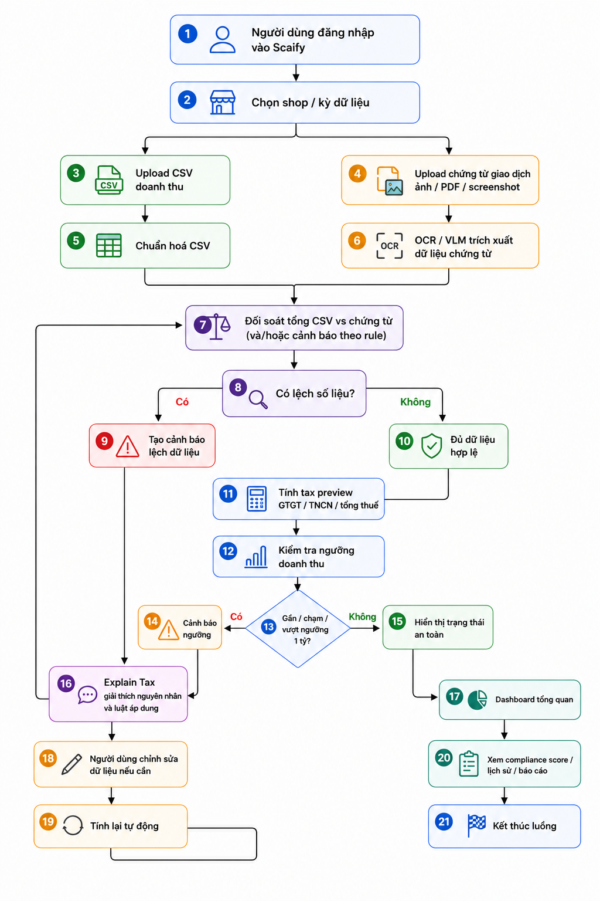

# Scaify — Đối soát & kiểm soát thuế TMĐT (A20-App-072)

## Links quan trọng

| Mục | Link |
|-----|------|
| **Repository** | https://github.com/a20-ai-thuc-chien/A20-App-072 |
| **Live URL** | https://a20-app-072.onehub.cfd/ |
| **Pitch deck (PDF)** | [docs/scaify_ai_pitch_deck/pitch_deck.pdf](./docs/scaify_ai_pitch_deck/pitch_deck.pdf) |
| **Pitch deck (HTML)** | [docs/scaify_ai_pitch_deck/pitch_deck.html](./docs/scaify_ai_pitch_deck/pitch_deck.html) |
| **Video demo** | _(điền link YouTube / Google Drive — public)_ |
| **Google Slides** | https://drive.google.com/drive/folders/1R2BjuzW8RLUDx12UBSOvQNO6eaWAEdW6?usp=sharing |
| **Weekly Journal** | [JOURNAL.md](./JOURNAL.md) |
| **Worklog** | [WORKLOG.md](./WORKLOG.md) · [Google Sheet worklog](https://docs.google.com/spreadsheets/d/1607ot6LMRPyM5h1kHQsm8-oQdDejLOv9nTGDx8dgzk4/edit?usp=sharing) |
| **Evaluation evidence** | [EVALUATION EVIDENCE.md](./EVALUATION%20EVIDENCE.md) |
| **AI logs & prompt mẫu** | [docs/AI_LOGS.md](./docs/AI_LOGS.md) |
| **Kiến trúc (chi tiết)** | [docs/04-system-architecture.md](./docs/04-system-architecture.md) |

---

## Tên dự án

**Scaify** — lớp pre-accounting AI cho người bán online và hộ kinh doanh (non-payment TMĐT).

---

## Mô tả ngắn gọn

Scaify giúp chủ shop **tải CSV doanh thu** và **chứng cứ giao dịch** (ảnh/PDF), **đối soát** hai nguồn, **ước tính thuế** (GTGT + TNCN theo ngành), **chấm điểm tuân thủ**, chuẩn bị **hồ sơ cuối năm**, và **hỏi đáp pháp lý** có trích dẫn (RAG). Không thay phần mềm kế toán hay kê khai chính thức lên cơ quan thuế.

**Vấn đề giải quyết:** dữ liệu rời rạc (Facebook, Zalo, TikTok, chuyển khoản, chat) → thiếu đối soát, khó chuẩn bị hồ sơ và dễ lệch khi tự kê khai.

---

## Tính năng chính

| Tính năng | Mô tả |
|-----------|--------|
| Upload đa định dạng | CSV doanh thu + ảnh/PDF chứng từ |
| OCR / VLM | Trích xuất số tiền, ngày, mã đơn từ chứng cứ |
| Đối soát & cảnh báo | So sánh CSV vs chứng cứ; alert lệch / ngưỡng |
| Ước tính thuế | GTGT + TNCN theo ngành (hàng hóa, dịch vụ, …) |
| Điểm tuân thủ | Thang 0–100, band Ổn định / Cần theo dõi / Cần xử lý |
| Explain & Correction | Giải thích cảnh báo; sửa số và tính lại |
| Hồ sơ cuối năm | Checklist 12 kỳ, chứng từ, ước tính thuế |
| RAG pháp lý | Chatbot căn cứ văn bản luật (Pinecone + rerank) |
| Multi-shop | Quản lý nhiều cửa hàng, báo cáo theo kỳ |

---

## Công nghệ sử dụng

| Tầng | Công nghệ |
|------|-----------|
| **Frontend** | React 19, Vite, TypeScript, Tailwind CSS, React Router |
| **Backend API** | Python 3.11+, FastAPI, Uvicorn |
| **Database** | MongoDB Atlas (Motor) — users, stores, revenue, tax, audit |
| **AI / Agent** | LangGraph — CSV agent, OCR/VLM agent (OpenAI), tax agent |
| **RAG** | Pinecone, Jina Rerank, embedding + generation |
| **Storage** | Google Cloud Storage (upload file production) |
| **Deploy** | Docker, Nginx, GCP VM |

---

## Kiến trúc hệ thống



**Luồng chính:** User → Frontend → Backend API → (CSV + OCR agents) → Tax → MongoDB · User → RAG API → Vector DB (luật).

Chi tiết + sơ đồ Mermaid: **[docs/04-system-architecture.md](./docs/04-system-architecture.md)** · Schema DB: [docs/05-database-schema.md](./docs/05-database-schema.md)

---

## Source code (runnable)

| Thành phần | Thư mục | Ghi chú |
|------------|---------|---------|
| **Frontend** | `ui/` | Dashboard, Upload, Compliance, Year-end, RAG chat |
| **Backend API** | `src/api/` | REST `/api/*`, auth, upload pipeline, summaries |
| **RAG API** | `src/api/api_rag/` | `/rag/*` chat pháp lý |
| **Agent / AI** | `src/sub_agent/`, `src/main.py` | LangGraph pipeline |
| **RAG core** | `src/rag/` | Ingest, search, generation |
| **Database** | MongoDB + `src/api/db.py` | Collections: `stores`, `revenue_reports`, `tax_estimations`, … |

**Chạy được:** xem [Cài đặt](#cài-đặt-lần-đầu) và [Chạy local](#chạy-local-khuyến-nghị). Health: `GET /api/health` → `{"status":"ok"}`.

---

## Cài đặt lần đầu

### Yêu cầu

| Công cụ | Phiên bản |
|---------|-----------|
| Python | 3.11+ |
| Node.js | 20+ |
| Git | bất kỳ |

**Dịch vụ bên ngoài:** MongoDB Atlas, OpenAI (LLM + OCR), Pinecone, Jina; GCS (khuyến nghị production).

### 1. Clone repository

```bash
git clone https://github.com/tranh223/VIN_072.git
cd VIN_072
```

### 2. Python virtual environment + dependencies

**Windows (PowerShell):**

```powershell
python -m venv venv
.\venv\Scripts\Activate.ps1
pip install -r requirements.txt
```

**macOS / Linux:**

```bash
python3 -m venv venv
source venv/bin/activate
pip install -r requirements.txt
```

### 3. Frontend dependencies

```bash
cd ui && npm install && cd ..
```

### 4. Biến môi trường

```bash
cp .env.example .env
```

Điền tối thiểu: `MONGO_URI`, `MONGO_DB_NAME`, `DEFAULT_*`, `OCR_*`, `PINECONE_*`, `JINA_API_KEY`. Chi tiết: `.env.example`.

### 5. Git hooks AI log (tuỳ chọn — khóa học)

```bash
bash scripts/setup_hooks.sh
```

Xem [AGENTS.md](./AGENTS.md) và [docs/AI_LOGS.md](./docs/AI_LOGS.md).

---

## Chạy local (khuyến nghị)

| Dịch vụ | Port | URL |
|---------|------|-----|
| Frontend | 3000 | http://localhost:3000 |
| Backend | 8000 | http://localhost:8000/docs |
| RAG | 8001 | http://localhost:8001/docs |

**Windows — một lệnh:**

```powershell
.\start.ps1
```

**Dừng:** `.\stop.ps1`

**macOS / Linux — 3 terminal:**

```bash
# T1
source venv/bin/activate && uvicorn src.api.app:app --host 0.0.0.0 --port 8000 --reload --reload-dir src
# T2
source venv/bin/activate && uvicorn src.api.api_rag.app:app --host 0.0.0.0 --port 8001 --reload --reload-dir src
# T3
cd ui && npm run dev
```

**Kiểm tra:** http://localhost:8000/api/health · http://localhost:8001/rag/health

---

## Hướng dẫn sử dụng sản phẩm

1. **Đăng ký / Đăng nhập** tại Live URL hoặc local.
2. **Cửa hàng** — tạo hoặc chọn shop (ví dụ Mint Shop).
3. **Upload** — chọn kỳ (tháng/năm), tải **CSV doanh thu** và/hoặc **ảnh/PDF chứng từ** → đợi pipeline xong.
4. **Kết quả** — xem doanh thu, thuế ước tính, cảnh báo đối soát, điểm tuân thủ.
5. **Tuân thủ** — điểm tổng hợp, số liệu tham khảo năm.
6. **Hồ sơ cuối năm** — checklist 12 kỳ + chứng từ.
7. **Chat pháp lý** — hỏi căn cứ luật (cần RAG service).
8. **Chỉnh sửa** — Correction nếu OCR/CSV cần điều chỉnh.

**Dữ liệu demo:** [testcase/demo_12_ky_baocao_cuoinam/](./testcase/demo_12_ky_baocao_cuoinam/) · [testcase/TEST_DATA_GUIDE.md](./testcase/TEST_DATA_GUIDE.md)

---

## Nhật ký & minh chứng quá trình (BTC)

| Tài liệu | Nội dung |
|----------|----------|
| [JOURNAL.md](./JOURNAL.md) | Weekly journal — mục tiêu, kết quả, khó khăn, AI tools (tuần 1–7) |
| [WORKLOG.md](./WORKLOG.md) | ADR, sprint, phân công, [Google Sheet](https://docs.google.com/spreadsheets/d/1607ot6LMRPyM5h1kHQsm8-oQdDejLOv9nTGDx8dgzk4/edit?usp=sharing) |
| [EVALUATION EVIDENCE.md](./EVALUATION%20EVIDENCE.md) | Pytest, kịch bản test, metrics; user testing & feedback (mục 11) |

---

## AI logs

- **Tổng hợp:** [docs/AI_LOGS.md](./docs/AI_LOGS.md) — prompt OCR, RAG, coding; hook `.ai-log/session.jsonl`; prompt injection tests.
- **Quy trình khóa học:** [AGENTS.md](./AGENTS.md)

---

## Tài liệu sản phẩm (đọc thêm)

Mục lục: [docs/README.md](./docs/README.md) — PRD, scope, competitor, go-to-market, pháp lý RAG.

---

## Chạy bằng Docker (tuỳ chọn)

```bash
docker compose up -d --build
```

Chi tiết: [docs/DEPLOY_GCP.md](./docs/DEPLOY_GCP.md)

---

## Cấu trúc thư mục

```
├── ui/                 # Frontend React + Vite
├── src/api/            # Backend + RAG FastAPI
├── src/sub_agent/      # CSV, OCR, tax agents
├── src/rag/            # RAG ingest & chat
├── testcase/           # Test & dữ liệu mẫu
├── docs/               # PRD, kiến trúc, AI logs, pitch deck
├── JOURNAL.md
├── WORKLOG.md
└── EVALUATION EVIDENCE.md
```

---

## Xử lý lỗi thường gặp

| Triệu chứng | Gợi ý |
|-------------|--------|
| Không kết nối backend | Kiểm tra :8000, http://localhost:8000/api/health |
| Chat RAG lỗi | :8001 + `PINECONE_*`, `JINA_API_KEY` |
| Upload/OCR lỗi | `OCR_API_KEY`, quota OpenAI |
| MongoDB lỗi | `MONGO_URI`, whitelist IP Atlas |

**Lưu ý:** job upload in-memory — restart backend mất job `processing`.
