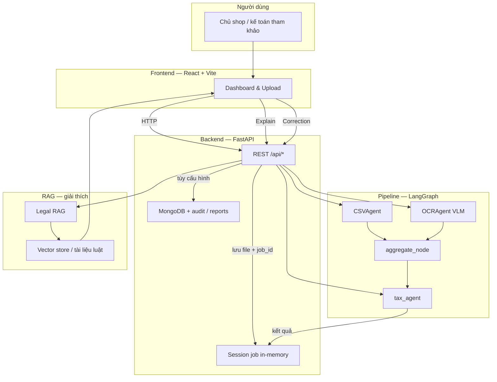

# Kiến trúc hệ thống — Scaify

Tài liệu mô tả **luồng dữ liệu và các thành phần chính** của repo hiện tại (scope **non-payment**: nền tảng không có luồng thanh toán; CSV là doanh thu tự ghi chép; chứng từ/ảnh dùng đối soát và chuẩn bị hồ sơ — **không thay kê khai chính thức**).

---

## 1. Tầng giao diện (Frontend)

- **Công nghệ:** React 19 + Vite + React Router + Tailwind CSS 4.
- **Vị trí mã:** `ui/`.
- **Chức năng chính:** đăng nhập/đăng ký, chọn shop & kỳ, upload CSV và/hoặc chứng từ (PDF/ảnh), xem kết quả trích xuất & ước tính thuế, giải thích cảnh báo, chỉnh sửa (correction), dashboard (Home, Compliance, History, Documents, …).
- **Gọi API:** qua proxy Vite tới backend (mặc định dev thường trỏ `http://127.0.0.1:8000`).

---

## 2. Tầng API (Backend)

- **Công nghệ:** FastAPI (Python).
- **Điểm vào ứng dụng:** `src/api/app.py` — mount các router dưới prefix `/api`.
- **Router tiêu biểu:**
  - `POST /api/upload` — nhận file, tạo `job_id`, chạy pipeline nền.
  - `GET /api/{job_id}/extraction`, `GET /api/{job_id}/tax`, `GET /api/{job_id}/explain`, `POST /api/{job_id}/correction`, …
  - `GET /api/jobs`, `GET /api/stores`, `GET /api/documents`, `GET /api/.../summaries`, auth, admin, feedback, v.v.

### Lưu trữ & phiên

- **Phiên xử lý upload (in-memory):** `src/api/session_store.py` — trạng thái `processing | done | error` và `result` sau pipeline (phù hợp dev / single process).
- **Dữ liệu bền (MongoDB):** Motor/PyMongo qua `src/api/db.py` — ví dụ `stores`, `tax_estimations`, `revenue_reports`, `audit_logs`, … (chi tiết schema nằm ở các route/service tương ứng).
- **File upload:** có thể đẩy lên object storage (Google Cloud Storage) tùy cấu hình — xem `src/api/services/storage_service.py` và biến môi trường trong `.env.example`.

---

## 3. Tầng pipeline (AI / LangGraph)

- **Orchestrator:** LangGraph trong `src/main.py`.
- **Luồng chính:**

  ```text
  START → fan-out (csv_worker | ocr_worker) → aggregate → tax → END
  ```

  - **`csv_worker`:** `CSVAgent` (`src/sub_agent/csv_agent.py`) — đọc CSV, chuẩn hóa header/cột `revenue`, tổng hợp `summary`, `records`.
  - **`ocr_worker`:** `OCRAgent` (`src/sub_agent/ocr_agent.py`) — VLM trích xuất một chứng từ/ảnh (schema: `document_category`, `amount`, `revenue`, `order_id`, …).
  - **`aggregate`:** gộp `worker_results` → `financial_summary` (tổng doanh thu CSV + doanh thu OCR ở mức **tổng hợp**, không join từng dòng theo `order_id` trong bước này).
  - **`tax`:** `tax_graph_node` / `tax_agent` (`src/sub_agent/tax_agent.py`) — ước tính GTGT/TNCN, dashboard, **cảnh báo** (ví dụ lệch CSV vs chứng từ, ngưỡng 1 tỷ, độ tin cậy OCR).

- **Hàm `main()`** (`src/main.py`) được gọi từ luồng upload sau khi file đã lưu tạm; kết quả được đưa vào session và (tùy cấu hình) persist qua `pipeline_persistence`.

---

## 4. Đối soát & cảnh báo (đúng với code hiện tại)

- **Lệch CSV ↔ chứng từ (OCR):** trong `tax_agent`, khi cả hai nguồn có doanh thu > 0, so sánh chênh lệch tuyệt đối và tỷ lệ; ngưỡng tham chiếu trong code: **≥ 5.000.000 VND hoặc ≥ 5%** (không chỉ “> 5 triệu” một chiều).
- **Ngưỡng doanh thu năm:** tham chiếu **1 tỷ VND/năm** (`_THRESHOLD_ANNUAL` trong `tax_agent`) — dùng cho cảnh báo / giải thích “vượt / gần ngưỡng”, không phải ngưỡng 500 triệu trong tài liệu cũ.
- **Không có** luồng “settlement sàn / khấu trừ thuế thay” như nền tảng có thanh toán; CSV mặc định chỉ cột doanh thu tự ghi chép (`revenue`, …).

---

## 5. Giải thích thuế (Explain) & RAG

- **API Explain:** `src/api/routes/explain.py` (và UI gọi theo `job_id`).
- **RAG pháp lý:** module dưới `src/rag/` — truy vấn tài liệu luật/chunk, sinh câu trả lời có kiểm soát; dùng khi người dùng cần căn cứ tham chiếu (không thay tư vấn thuế chính thức).

---

## 6. Correction (sửa dữ liệu & tính lại)

- **API:** `src/api/routes/correction.py` — nhận chỉnh sửa từ UI, cập nhật session / kết quả ước tính và có thể ghi `audit_logs`.
- **Ý nghĩa sản phẩm:** người dùng sửa field liên quan doanh thu/chứng từ → hệ thống **tính lại** preview thuế và cảnh báo (tương đương “vòng lặp” trên sơ đồ nghiệp vụ, không nhất thiết tái sử dụng đúng tên node LangGraph trong tài liệu).

---

## 7. Sơ đồ tổng quan

**Sơ đồ ảnh (README / nộp bài):** [system-architecture.png](./system-architecture.png)

### Mermaid (chi tiết luồng)



---

## 8. Khác biệt so với sơ đồ nghiệp vụ “21 bước” (nếu bạn dùng slide)

| Slide / ý tưởng thường gặp | Thực tế trong code |
|----------------------------|---------------------|
| Ghép từng giao dịch theo `order_id` giữa CSV và OCR | **Chưa có** engine match từng dòng; đối soát chính ở mức **tổng doanh thu** (+ metadata shop/kỳ từ upload). |
| “PostgreSQL + Next.js” | **Không đúng** repo hiện tại: **MongoDB** (dữ liệu bền chính) + **React/Vite**. |
| Ngưỡng 500 triệu | Đã thay bằng logic **tham chiếu 1 tỷ/năm** trong tax agent. |

---

## 9. Tài liệu liên quan

- Scope & thuế mới: `docs/explain_tax_new_scope/` (xem `12-tax-logic-new-scope.md`, `13-alert-rules-new-scope.md`, `14-explain-and-editable-fields.md`)
- Hướng dẫn agent: `AGENTS.md`

---


